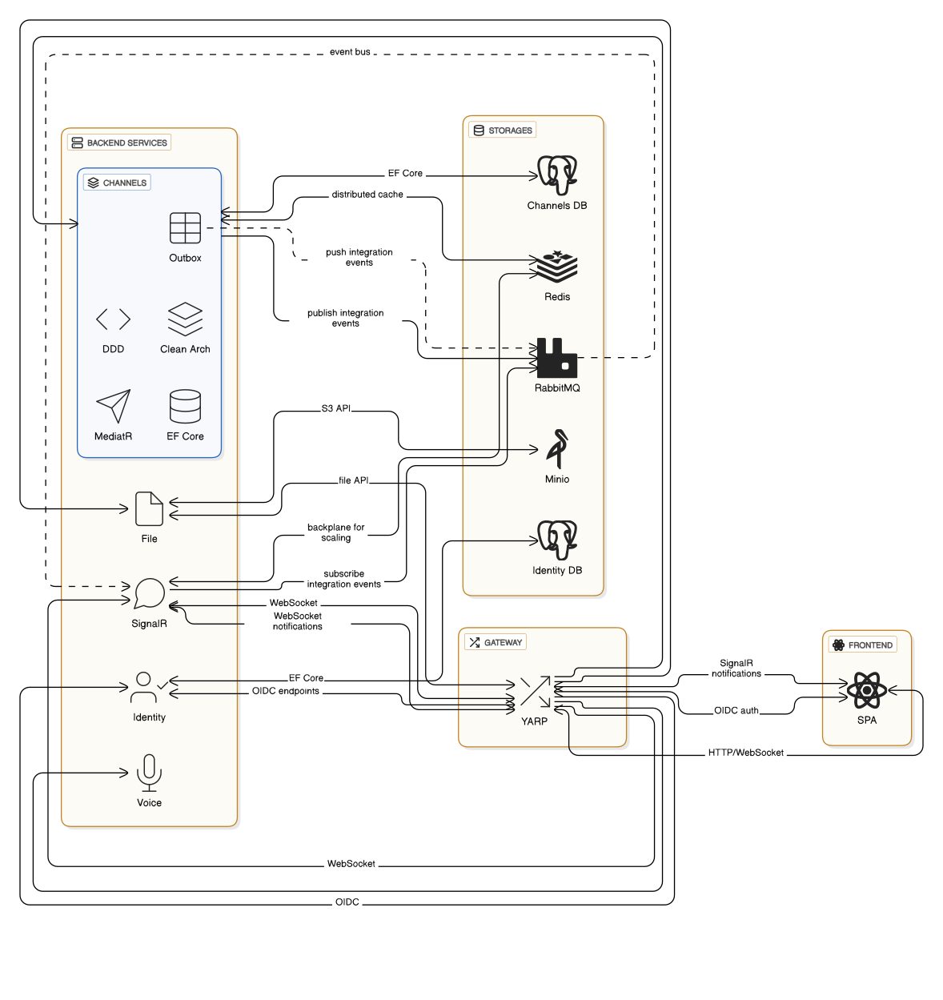

# 🎤 Huddle
[](https://dotnet.microsoft.com/)


**Huddle** is a real-time chat application (a Discord alternative) built on .NET using a service-oriented architecture and **.NET Aspire**. This project demonstrates the practical application of DDD, Clean Architecture, and patterns for building resilient distributed systems.

## 🚀 Features
- 🎥 **WebRTC** for real-time voice and video communication.
- 🏗️ **Clean Architecture + DDD**: strict separation into Domain, Application, Infrastructure, and API layers.
- 📨 **CQRS with MediatR**: clear separation of commands and queries.
- 📦 **Outbox Pattern**: guaranteed event delivery via RabbitMQ.
- 🔍 **Observability**: OpenTelemetry, structured logging (Serilog), and the .NET Aspire dashboard out of the box.

## 🏛️ Architecture



## 🛠️ Getting Started
- Ensure you have the .NET 8 SDK (or later) and Docker Desktop installed.
- Trust the development HTTPS certificates:
```dotnet dev-certs https --trust ```
- Run the AppHost project:
 ```cd src/Huddle.AppHost ```
 ``` dotnet run ```

## 📚 Inspiration & References
- https://github.com/dotnet/eShop
- https://github.com/dotnet-architecture/eShopOnContainers/tree/dev
- https://github.com/ardalis/CleanArchitecture
- https://learn.microsoft.com/ru-ru/dotnet/architecture/microservices/
